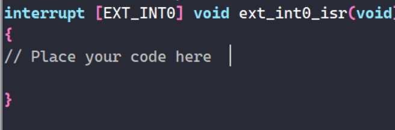

# 전자기실습 AVR 실습코드

## 직렬통신

RS-232를 원래 사용해야 함 -> 다른 MCU가 알아서 해줌

### 인터럽트 우선순위
1. 리셋버튼
... 암튼 datasheet보면 확인할 수 있음


## 실습
```
INT 0 : 
PC INT 0 : PB0(PCINT0)
```

이거 쓸거임


falling edge는 떨어지는거라고 함


interrupt 가 type임
```
interrupt [EXT_INT1] void ext_int1_isr(void)
{
// Place your code here

}

[EXT_INT1I] 은 수정 x
```

인터럽트 발생시 정의한 함수가 실행되는 거임


## 과제 
인터럽트 전에는 1초에 한번씩 깜박임
인터럽트 들어오면 0.5초에 한번씩 깜박임
