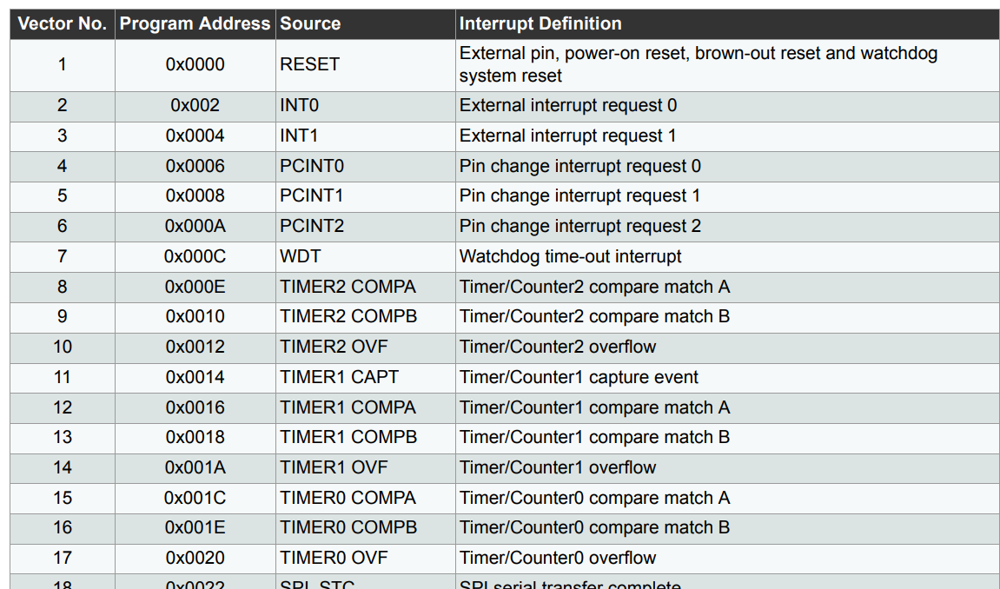
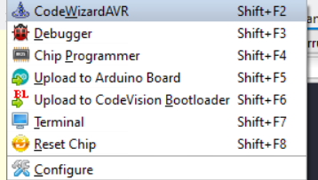
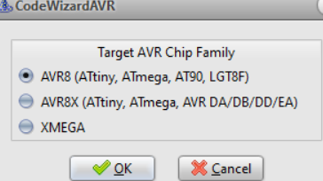
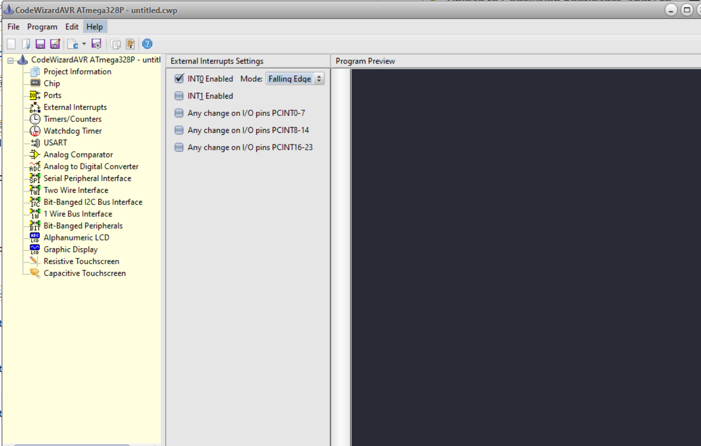

# 전자기실습 AVR 실습코드

## 직렬통신

RS-232를 원래 사용해야 함 -> 다른 MCU가 알아서 해줌

### 인터럽트 우선순위
1. 리셋버튼
... 암튼 datasheet보면 확인할 수 있음



## 실습
```
INT 0 : 
PC INT 0 : PB0(PCINT0) <- 이거 쓸거임
```

### 초기 설정

#### codeWizardAVR 실행





#### External Interrupts에서 INT0 를 low로 설정해준다.


#### falling Edge는 제어하기 어려워서 일단 보류

falling edge는 떨어지는거라고 함


- 인터럽트시 실행하는 함수를 보면 반환형이 interrupt인 것을 확인할 수 있음
- 인터럽트 발생시 정의한 함수가 실행되는 거임
```
interrupt [EXT_INT1] void ext_int1_isr(void)
{
// Place your code here

}

[EXT_INT1I] 은 수정 x
```

인터럽트 발생시 정의한 함수가 실행되는 거임


### 수업과제 

1. 인터럽트 전에는 1초에 한번씩 깜박임
2. 인터럽트 들어오면 0.5초에 한번씩 깜박임

#### 참고사항

interrupt를 low로 설정하였으므로 interrupt신호를 주기 위해서는
ground랑 INT0포트를 연결해야 하며 interrupt신호를 주지 않을 때는
high(5V)를 줘야 제대로 작동함

#### 코드

```C
// I/O Registers definitions
#include <mega328p.h>
#include <delay.h>

// External Interrupt 0 service routine
interrupt [EXT_INT0] void ext_int0_isr(void)
{
// Place your code here
   int i;

    for(i = 0; i < 5; i++) {
        PORTD = 0x00;
        delay_ms(100);
        PORTD = 1 << 7;
        delay_ms(100); 
    }
}

// Declare your global variables here

void main(void)
{
// Declare your local variables here

// Clock Oscillator division factor: 1
#pragma optsize-
CLKPR=(1<<CLKPCE);
CLKPR=(0<<CLKPCE) | (0<<CLKPS3) | (0<<CLKPS2) | (0<<CLKPS1) | (0<<CLKPS0);
#ifdef _OPTIMIZE_SIZE_
#pragma optsize+
#endif

// Input/Output Ports initialization

// Port D initialization
// Function: Bit7=In Bit6=In Bit5=In Bit4=In Bit3=In Bit2=In Bit1=In Bit0=In 
DDRD=(1<<DDD7) | (0<<DDD6) | (0<<DDD5) | (0<<DDD4) | (0<<DDD3) | (0<<DDD2) | (0<<DDD1) | (0<<DDD0);
// State: Bit7=T Bit6=T Bit5=T Bit4=T Bit3=T Bit2=T Bit1=T Bit0=T 
PORTD=(0<<PORTD7) | (0<<PORTD6) | (0<<PORTD5) | (0<<PORTD4) | (0<<PORTD3) | (0<<PORTD2) | (0<<PORTD1) | (0<<PORTD0);

// External Interrupt(s) initialization
// INT0: On
// INT0 Mode: Falling Edge
// INT1: Off
// Interrupt on any change on pins PCINT0-7: Off
// Interrupt on any change on pins PCINT8-14: Off
// Interrupt on any change on pins PCINT16-23: Off
EICRA=(0<<ISC11) | (0<<ISC10) | (1<<ISC01) | (0<<ISC00);
EIMSK=(0<<INT1) | (1<<INT0);
EIFR=(0<<INTF1) | (1<<INTF0);
PCICR=(0<<PCIE2) | (0<<PCIE1) | (0<<PCIE0);

// USART initialization
// USART disabled
UCSR0B=(0<<RXCIE0) | (0<<TXCIE0) | (0<<UDRIE0) | (0<<RXEN0) | (0<<TXEN0) | (0<<UCSZ02) | (0<<RXB80) | (0<<TXB80);

// Analog Comparator initialization
// Analog Comparator: Off
// The Analog Comparator's positive input is
// connected to the AIN0 pin
// The Analog Comparator's negative input is
// connected to the AIN1 pin
ACSR=(1<<ACD) | (0<<ACBG) | (0<<ACO) | (0<<ACI) | (0<<ACIE) | (0<<ACIC) | (0<<ACIS1) | (0<<ACIS0);
ADCSRB=(0<<ACME);
// Digital input buffer on AIN0: On
// Digital input buffer on AIN1: On
DIDR1=(0<<AIN0D) | (0<<AIN1D);

// ADC initialization
// ADC disabled
ADCSRA=(0<<ADEN) | (0<<ADSC) | (0<<ADATE) | (0<<ADIF) | (0<<ADIE) | (0<<ADPS2) | (0<<ADPS1) | (0<<ADPS0);

// SPI initialization
// SPI disabled
SPCR=(0<<SPIE) | (0<<SPE) | (0<<DORD) | (0<<MSTR) | (0<<CPOL) | (0<<CPHA) | (0<<SPR1) | (0<<SPR0);

// TWI initialization
// TWI disabled
TWCR=(0<<TWEA) | (0<<TWSTA) | (0<<TWSTO) | (0<<TWEN) | (0<<TWIE);

// Globally enable interrupts
#asm("sei")

while (1)
    {
        // Place your code here
        PORTD = 0x00;
        delay_ms(1000);
        PORTD = 1 << 7;
        delay_ms(1000);
    }
}
```

#### 주의
- 새로운 파일 생성시 configure 지정하기
- PORT번호 맞는지 확인하기(실수 안하려면 그냥 비트 연산 쓰셈)

### 외부환경 변화 감시
- intrrupt
- GPIO (General purpose input/ output)
    - PORTD.7 = 1
    - DDR : 0.5가 입력되었는지 확인 가능