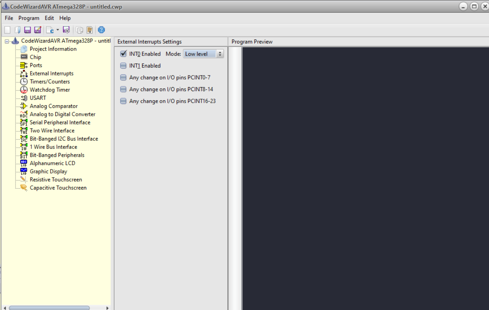

# 전자기실습 AVR 실습코드

## 직렬통신

RS-232를 원래 사용해야 함 -> 다른 MCU가 알아서 해줌

### 인터럽트 우선순위
1. 리셋버튼
... 암튼 datasheet보면 확인할 수 있음


### 회로도


## 실습
```
INT 0 : 
PC INT 0 : PB0(PCINT0) <- 이거 쓸거임
```

### 초기 설정

#### codeWizardAVR 실행


#### External Interrupts에서 INT0 를 low로 설정해준다.



#### falling Edge는 제어하기 어려워서 일단 보류

falling edge는 떨어지는거라고 함


- 인터럽트시 실행하는 함수를 보면 반환형이 interrupt인 것을 확인할 수 있음
- 인터럽트 발생시 정의한 함수가 실행되는 거임
```
interrupt [EXT_INT1] void ext_int1_isr(void)
{
// Place your code here

}

[EXT_INT1I] 은 수정 x
```

인터럽트 발생시 정의한 함수가 실행되는 거임
### 터미널 연결
usb가 연결된 상태에서 eclass에 올라온 터미널을 설치한다.
COM N으로 설정한 뒤 전화기 버튼을 눌러서 연결한다.
baud나 hz설정 나오면 9600으로 설정해야함

#### 코드상 추가부분
```c
//8data, 1stop, 9600(占쏙옙占?占쏙옙占?
UCSR0A=(0<<RXC0) | (0<<TXC0) | (0<<UDRE0) | (0<<FE0) | (0<<DOR0) | (0<<UPE0) | (0<<U2X0) | (0<<MPCM0);
UCSR0B=(0<<RXCIE0) | (0<<TXCIE0) | (0<<UDRIE0) | (1<<RXEN0) | (1<<TXEN0) | (0<<UCSZ02) | (0<<RXB80) | (0<<TXB80);
UCSR0C=(0<<UMSEL01) | (0<<UMSEL00) | (0<<UPM01) | (0<<UPM00) | (0<<USBS0) | (1<<UCSZ01) | (1<<UCSZ00) | (0<<UCPOL0);
UBRR0H=0x00;
UBRR0L=0x67;
```


### 수업과제 

1. 인터럽트 전에는 1초에 한번씩 깜박임
2. 인터럽트 들어오면 0.5초에 한번씩 깜박임

#### 참고사항

interrupt를 low로 설정하였으므로 interrupt신호를 주기 위해서는
ground랑 INT0포트를 연결해야 하며 interrupt신호를 주지 않을 때는
high(5V)를 줘야 제대로 작동함

#### 코드

```C
// I/O Registers definitions
#include <mega328p.h>
#include <delay.h>

// External Interrupt 0 service routine
interrupt [EXT_INT0] void ext_int0_isr(void)
{
// Place your code here
   int i;

    for(i = 0; i < 5; i++) {
        PORTD = 0x00;
        delay_ms(100);
        PORTD = 1 << 7;
        delay_ms(100); 
    }
}

// Declare your global variables here

void main(void)
{
// Declare your local variables here

// Clock Oscillator division factor: 1
#pragma optsize-
CLKPR=(1<<CLKPCE);
CLKPR=(0<<CLKPCE) | (0<<CLKPS3) | (0<<CLKPS2) | (0<<CLKPS1) | (0<<CLKPS0);
#ifdef _OPTIMIZE_SIZE_
#pragma optsize+
#endif

// Input/Output Ports initialization

// Port D initialization
// Function: Bit7=In Bit6=In Bit5=In Bit4=In Bit3=In Bit2=In Bit1=In Bit0=In 
DDRD=(1<<DDD7) | (0<<DDD6) | (0<<DDD5) | (0<<DDD4) | (0<<DDD3) | (0<<DDD2) | (0<<DDD1) | (0<<DDD0);
// State: Bit7=T Bit6=T Bit5=T Bit4=T Bit3=T Bit2=T Bit1=T Bit0=T 
PORTD=(0<<PORTD7) | (0<<PORTD6) | (0<<PORTD5) | (0<<PORTD4) | (0<<PORTD3) | (0<<PORTD2) | (0<<PORTD1) | (0<<PORTD0);

// External Interrupt(s) initialization
// INT0: On
// INT0 Mode: Falling Edge
// INT1: Off
// Interrupt on any change on pins PCINT0-7: Off
// Interrupt on any change on pins PCINT8-14: Off
// Interrupt on any change on pins PCINT16-23: Off
EICRA=(0<<ISC11) | (0<<ISC10) | (1<<ISC01) | (0<<ISC00);
EIMSK=(0<<INT1) | (1<<INT0);
EIFR=(0<<INTF1) | (1<<INTF0);
PCICR=(0<<PCIE2) | (0<<PCIE1) | (0<<PCIE0);

// USART initialization
// USART disabled
UCSR0B=(0<<RXCIE0) | (0<<TXCIE0) | (0<<UDRIE0) | (0<<RXEN0) | (0<<TXEN0) | (0<<UCSZ02) | (0<<RXB80) | (0<<TXB80);

// Analog Comparator initialization
// Analog Comparator: Off
// The Analog Comparator's positive input is
// connected to the AIN0 pin
// The Analog Comparator's negative input is
// connected to the AIN1 pin
ACSR=(1<<ACD) | (0<<ACBG) | (0<<ACO) | (0<<ACI) | (0<<ACIE) | (0<<ACIC) | (0<<ACIS1) | (0<<ACIS0);
ADCSRB=(0<<ACME);
// Digital input buffer on AIN0: On
// Digital input buffer on AIN1: On
DIDR1=(0<<AIN0D) | (0<<AIN1D);

// ADC initialization
// ADC disabled
ADCSRA=(0<<ADEN) | (0<<ADSC) | (0<<ADATE) | (0<<ADIF) | (0<<ADIE) | (0<<ADPS2) | (0<<ADPS1) | (0<<ADPS0);

// SPI initialization
// SPI disabled
SPCR=(0<<SPIE) | (0<<SPE) | (0<<DORD) | (0<<MSTR) | (0<<CPOL) | (0<<CPHA) | (0<<SPR1) | (0<<SPR0);

// TWI initialization
// TWI disabled
TWCR=(0<<TWEA) | (0<<TWSTA) | (0<<TWSTO) | (0<<TWEN) | (0<<TWIE);

// Globally enable interrupts
#asm("sei")

while (1)
    {
        // Place your code here
        PORTD = 0x00;
        delay_ms(1000);
        PORTD = 1 << 7;
        delay_ms(1000);
    }
}
```

#### 주의
- 새로운 파일 생성시 configure 지정하기
- PORT번호 맞는지 확인하기(실수 안하려면 그냥 비트 연산 쓰셈)

### 외부환경 변화 감시(5.21)
- intrrupt
- GPIO (General purpose input/ output)
    - PORTD.7 = 1
    - DDR : 0.5가 입력되었는지 확인 가능

- ADC(analog - Digital converter) : 기준 전압 입력(5V를 기준으로 작은 단위로 분배하여 판단을 용이하게 함), 비교기

### 실습
1. Digital 입력 : GPIO중에서 input사용
2. 비교기 : (ex 특정 기준보다 높으면 5, 낮으면 0 뭐 이런식으로)
3. AD컨버터
4. 온도 검출 (AD라고함) : 온도에 따라서 전압을 변환하는 것 같음
5. EEPROM에 온도를 저장할 수도 있음

#### 참고

7번 핀을 입력으로 할래 -> DDR7 = 0
출력일때 -> DDR7 = 1

#### 1. Digital 입력 실습

PORTA 3입력값이 5V이면 printf해보셈

```c
    if(PIN7 == 1) {
        printf(...)
    }
```

(수정)


PORTD.3 -> input으로 할거
    0V입력이면 LED 500ms에 한번씩 점등, 5V이면 더 100ms에 한번씩 점등

PORTD.5은 output임

ADC4번을 조도센서에 연결하겠다.


AREF에 전압을 넣어줘야 함


ADC0 ~ ADC7에서 입력을 받을 수 있음
ex) 온도, 습도, 조도를 각각 다르게 입력을 받을 수 있음(외부 환경을 여러개 입력받음)

예시)
ADC4번을 조도센서에 연결하겠다.

AlN0 ~ AlN

```c
// ADC Voltage Reference: AVCC pin
#define ADC_VREF_TYPE ((0<<REFS1) | (1<<REFS0) | (0<<ADLAR))
```
어떤 놈을 아날로그 레퍼런스로 사용했는지 나타냄


```c
// Read Voltage=read_adc*(Vref/1024.0)
```

0 ~ 5V까지를 1024개로 막 쪼갬
만약 ADC가 500이면 500 / 1024 * 5V가 입력전압임


```c
unsigned int read_adc(unsigned char adc_input)
{
    ADMUX=adc_input | ADC_VREF_TYPE;
    // Delay needed for the stabilization of the ADC input voltage
    delay_us(10);
    // Start the AD conversion
    ADCSRA|=(1<<ADSC);
    // Wait for the AD conversion to complete
    while ((ADCSRA & (1<<ADIF))==0);
    ADCSRA|=(1<<ADIF);
    return ADCW;
}
```

우리는 adcinput을 4로 쓸거다.


#### 1. Digital 입력 실습 코드
```c
#include <mega328p.h>
#include <delay.h>
#include <stdio.h>

// ADC Voltage Reference: AVCC pin
#define ADC_VREF_TYPE ((0<<REFS1) | (1<<REFS0) | (0<<ADLAR))

// Read the AD conversion result
// Read Voltage=read_adc*(Vref/1024.0)
unsigned int read_adc(unsigned char adc_input) {
  ADMUX=adc_input | ADC_VREF_TYPE;
  // Delay needed for the stabilization of the ADC input voltage
  delay_us(10);
  // Start the AD conversion
  ADCSRA|=(1<<ADSC);
  // Wait for the AD conversion to complete
  while ((ADCSRA & (1<<ADIF))==0);
  ADCSRA|=(1<<ADIF);
  return ADCW;
}

// Declare your global variables here

void main(void) {
  // Declare your local variables here
  int i;
  int input_PIND, k_adc;
  float adc_voltage;

  // Clock Oscillator division factor: 1
  #pragma optsize-
  CLKPR=(1<<CLKPCE);
  CLKPR=(0<<CLKPCE) | (0<<CLKPS3) | (0<<CLKPS2) | (0<<CLKPS1) | (0<<CLKPS0);
  #ifdef _OPTIMIZE_SIZE_
  #pragma optsize+
  #endif

  // Port D initialization
  // Function: Bit7=In Bit6=In Bit5=Out Bit4=In Bit3=In Bit2=In Bit1=In Bit0=In 
  DDRD = (1<<DDD5) | (0<<DDD3);
  // State: Bit7=T Bit6=T Bit5=0 Bit4=T Bit3=T Bit2=T Bit1=T Bit0=T 
  PORTD = (0<<PORTD5);


  //8data, 1stop, 9600(占쏙옙占?占쏙옙占?
    UCSR0A=(0<<RXC0) | (0<<TXC0) | (0<<UDRE0) | (0<<FE0) | (0<<DOR0) | (0<<UPE0) | (0<<U2X0) | (0<<MPCM0);
    UCSR0B=(0<<RXCIE0) | (0<<TXCIE0) | (0<<UDRIE0) | (1<<RXEN0) | (1<<TXEN0) | (0<<UCSZ02) | (0<<RXB80) | (0<<TXB80);
    UCSR0C=(0<<UMSEL01) | (0<<UMSEL00) | (0<<UPM01) | (0<<UPM00) | (0<<USBS0) | (1<<UCSZ01) | (1<<UCSZ00) | (0<<UCPOL0);
    UBRR0H=0x00;
    UBRR0L=0x67;

  // Analog Comparator initialization
  // Analog Comparator: On
  // The Analog Comparator's positive input is
  // connected to the AIN0 pin
  // The Analog Comparator's negative input is
  // connected to the AIN1 pin
  // Analog Comparator Input Capture by Timer/Counter 1: Off
  ACSR=(0<<ACD) | (0<<ACBG) | (0<<ACO) | (0<<ACI) | (0<<ACIE) | (0<<ACIC) | (0<<ACIS1) | (0<<ACIS0);
  // Digital input buffer on AIN0: On
  // Digital input buffer on AIN1: On
  DIDR1=(0<<AIN0D) | (0<<AIN1D);

  // ADC initialization
  // ADC Clock frequency: 1000.000 kHz
  // ADC Auto Trigger Source: Software
  ADCSRA=(1<<ADEN) | (0<<ADSC) | (0<<ADATE) | (0<<ADIF) | (0<<ADIE) | (1<<ADPS2) | (0<<ADPS1) | (0<<ADPS0);
  ADCSRB=(0<<ADTS2) | (0<<ADTS1) | (0<<ADTS0);
  // Digital input buffers on ADC0: On, ADC1: On, ADC2: On, ADC3: On
  // ADC4: On, ADC5: On
  DIDR0=(0<<ADC5D) | (0<<ADC4D) | (0<<ADC3D) | (0<<ADC2D) | (0<<ADC1D) | (0<<ADC0D);

  // SPI initialization
  // SPI disabled
  SPCR=(0<<SPIE) | (0<<SPE) | (0<<DORD) | (0<<MSTR) | (0<<CPOL) | (0<<CPHA) | (0<<SPR1) | (0<<SPR0);

  // TWI initialization
  // TWI disabled
  TWCR=(0<<TWEA) | (0<<TWSTA) | (0<<TWSTO) | (0<<TWEN) | (0<<TWIE);

  
   while (1) {
     // Place your code here


    input_PIND = PIND;
    printf("%d is the input of PORTD\r\n", PIND);

     for(i = 0; i < 5; i++) {
       if (PIND & (1 << 3)) { /// if input is 5V, then blink LED per 100ms.
         PORTD = 0; // LED OFF
         delay_ms(100);
         PORTD = 1 << 5; // LED ON
         delay_ms(100);
       } else { // if input is not 5V, then blink LED per 500ms.
         PORTD = 0; // LED OFF
         delay_ms(500);
         PORTD = 1 << 5; // LED ON
         delay_ms(500);
       }
     }

     k_adc = read_adc(4);
     adc_voltage = (k_adc/1024.0) * 5.0;
     printf("Voltage is %d\n\r", (int)adc_voltage);

   }
  
  return;
}
```

```c
if (PIND & (1 << 3)) {
    PORTD = 0; 
    delay_ms(100);
    PORTD = 1 << 5;
    delay_ms(100);
} 
```

PIND중 3번째 비트가 1이면 5V인가로 보고 빠르게 깜박거리는 코드가 실행된다.

```c
else {
    PORTD = 0; 
    delay_ms(500);
    PORTD = 1 << 5;
    delay_ms(500);
}
```

PIND중 3번째 비트가 1이 아니면 0V인가로 보고 느리게 깜박거리는 코드가 실행된다.

다음은 0V입력 시 printf출력값이다.
33을 확인할 수 있고 왜 33인지는 모르겠다.


다음은 5V입력 시 printf출력값이다.
44를 확인할 수 있고 왜 44인지도 모르겠다.


